# GitHub Workflow Guide for Telegram Gym Bot Team

## Table of Contents
1. [Getting Started](#getting-started)
2. [Branch Strategy](#branch-strategy)
3. [Development Workflow](#development-workflow)
4. [Commit Guidelines](#commit-guidelines)
5. [Pull Request Process](#pull-request-process)
6. [Code Review Standards](#code-review-standards)
7. [Issue Management](#issue-management)
8. [CI/CD Pipeline](#cicd-pipeline)
9. [Team Roles & Responsibilities](#team-roles--responsibilities)
10. [Emergency Procedures](#emergency-procedures)

---

## Getting Started

### Initial Setup

1. **Fork & Clone the Repository**
```bash
# Fork the repository on GitHub first, then:
git clone https://github.com/YOUR_USERNAME/telegram-gym-bot.git
cd telegram-gym-bot

# Add upstream remote
git remote add upstream https://github.com/veacheslavv/telegram-gym-bot.git
```

2. **Set Up Development Environment**
```bash
# Create virtual environment
python -m venv .venv

# Activate virtual environment
# On Windows:
.venv\Scripts\activate
# On macOS/Linux:
source .venv/bin/activate

# Install dependencies
pip install -r requirements.txt
pip install -r requirements-dev.txt  # When created

# Copy environment variables
cp .env.example .env
# Edit .env with your bot token
```

3. **Configure Git**
```bash
# Set your identity
git config --global user.name "Your Name"
git config --global user.email "your.email@example.com"

# Set up commit signing (recommended)
git config --global commit.gpgsign true
```

---

## Branch Strategy

### Branch Types

```
main (production)
    ├── develop (integration)
    │   ├── feature/dev1-workout-tracking
    │   ├── feature/dev2-exercise-database
    │   ├── feature/dev3-progress-charts
    │   ├── feature/dev4-social-features
    │   ├── feature/dev5-rest-timers
    │   └── feature/dev6-nutrition
    ├── hotfix/critical-bug-fix
    └── release/v1.0.0
```

### Branch Naming Convention

- **Feature branches**: `feature/dev[NUMBER]-feature-name`
  - Example: `feature/dev1-workout-tracking`
  
- **Bug fix branches**: `bugfix/issue-number-description`
  - Example: `bugfix/42-fix-dispatcher-variable`
  
- **Hotfix branches**: `hotfix/critical-issue`
  - Example: `hotfix/security-patch`
  
- **Release branches**: `release/vX.Y.Z`
  - Example: `release/v1.0.0`

### Branch Rules

1. **main branch**
   - Protected branch - no direct pushes
   - Only accepts PRs from develop or hotfix branches
   - Requires all tests to pass
   - Requires code review approval

2. **develop branch**
   - Integration branch for features
   - Protected - no direct pushes
   - Accepts PRs from feature branches
   - Must be stable and tested

3. **feature branches**
   - Created from develop
   - One feature per branch
   - Deleted after merging

---

## Development Workflow

### Standard Development Flow

```mermaid
graph LR
    A[Create Issue] --> B[Create Feature Branch]
    B --> C[Develop Feature]
    C --> D[Write Tests]
    D --> E[Local Testing]
    E --> F[Commit Changes]
    F --> G[Push to Origin]
    G --> H[Create Pull Request]
    H --> I[Code Review]
    I --> J[Address Feedback]
    J --> K[Merge to Develop]
    K --> L[Delete Feature Branch]
```



### Step-by-Step Process

1. **Start New Feature**
```bash
# Update your local repository
git checkout main
git pull upstream main
git checkout develop
git pull upstream develop

# Create feature branch
git checkout -b feature/dev1-new-feature

# Make sure you're up to date
git pull upstream develop
```

2. **Develop Your Feature**
```bash
# Make changes
# Write code according to standards
# Add tests for new functionality

# Check your changes
git status
git diff

# Run tests locally
pytest tests/

# Format code
black src/
isort src/
```

3. **Commit Your Work**
```bash
# Stage changes
git add -A

# Or stage specific files
git add src/handlers/workout.py
git add tests/test_workout.py

# Commit with meaningful message
git commit -m "feat(workout): add exercise search functionality"
```

4. **Push and Create PR**
```bash
# Push to your fork
git push origin feature/dev1-new-feature

# Create Pull Request on GitHub
# Go to GitHub and click "New Pull Request"
```

5. **After PR Approval**
```bash
# Update local develop branch
git checkout develop
git pull upstream develop

# Delete local feature branch
git branch -d feature/dev1-new-feature

# Delete remote feature branch
git push origin --delete feature/dev1-new-feature
```

---

## Commit Guidelines

### Commit Message Format

We follow the Conventional Commits specification:

```
<type>(<scope>): <subject>

<body>

<footer>
```

### Types

- **feat**: New feature
- **fix**: Bug fix
- **docs**: Documentation changes
- **style**: Code style changes (formatting, semicolons, etc.)
- **refactor**: Code refactoring
- **perf**: Performance improvements
- **test**: Adding or modifying tests
- **build**: Build system changes
- **ci**: CI/CD changes
- **chore**: Other changes that don't modify src or test files

### Examples

```bash
# Feature
git commit -m "feat(timer): add countdown voice notifications"

# Bug fix
git commit -m "fix(workout): resolve database connection leak"

# Documentation
git commit -m "docs(readme): add installation instructions"

# With body
git commit -m "feat(nutrition): implement calorie tracking

- Add calorie database
- Create food search API
- Implement daily tracking UI

Closes #123"
```

### Commit Best Practices

1. **Atomic Commits**: One logical change per commit
2. **Present Tense**: Use "add" not "added"
3. **Imperative Mood**: "fix" not "fixes" or "fixed"
4. **No Period**: Don't end subject with period
5. **Capitalize**: Start with capital letter
6. **50/72 Rule**: Subject max 50 chars, body wrapped at 72

---

## Pull Request Process

### PR Template

Create `.github/pull_request_template.md`:

```markdown
## Description
Brief description of changes

## Type of Change
- [ ] Bug fix
- [ ] New feature
- [ ] Breaking change
- [ ] Documentation update

## Changes Made
- Change 1
- Change 2

## Testing
- [ ] Unit tests pass
- [ ] Integration tests pass
- [ ] Manual testing completed

## Checklist
- [ ] Code follows style guidelines
- [ ] Self-review completed
- [ ] Comments added for complex code
- [ ] Documentation updated
- [ ] No new warnings
- [ ] Tests added/updated
- [ ] All tests passing

## Related Issues
Closes #(issue number)

## Screenshots (if applicable)
```

### PR Guidelines

1. **PR Title**: Follow commit message format
   - Example: `feat(workout): add exercise search functionality`

2. **PR Size**: Keep PRs small and focused
   - Aim for < 400 lines of code changes
   - Split large features into multiple PRs

3. **Draft PRs**: Use draft PRs for work in progress

4. **Labels**: Apply appropriate labels
   - `enhancement`, `bug`, `documentation`
   - `needs-review`, `work-in-progress`, `ready-to-merge`

5. **Assignees**: Assign yourself and reviewers

---

## Code Review Standards

### For Reviewers

#### Review Checklist

- [ ] **Functionality**: Does the code do what it's supposed to?
- [ ] **Tests**: Are there adequate tests?
- [ ] **Security**: Any security vulnerabilities?
- [ ] **Performance**: Any performance issues?
- [ ] **Code Quality**: Is the code clean and maintainable?
- [ ] **Documentation**: Is the code documented?
- [ ] **Style**: Does it follow our style guide?

#### Review Comments

```python
# Suggest specific improvements
# Bad: "This could be better"
# Good: "Consider using list comprehension for better performance"

# Example:
# Instead of:
result = []
for item in items:
    if item.active:
        result.append(item.name)

# Suggest:
result = [item.name for item in items if item.active]
```

### For Authors

1. **Respond to all comments**
2. **Mark conversations as resolved**
3. **Request re-review after changes**
4. **Don't take feedback personally**
5. **Ask questions if unclear**

---

## Issue Management

### Issue Types

1. **Bug Report**
```markdown
**Description**: Clear description of the bug
**Steps to Reproduce**:
1. Step 1
2. Step 2
**Expected Behavior**: What should happen
**Actual Behavior**: What actually happens
**Environment**: OS, Python version, etc.
```

2. **Feature Request**
```markdown
**Feature Description**: What you want
**Use Case**: Why you need it
**Proposed Solution**: How it might work
**Alternatives**: Other solutions considered
```

3. **Task**
```markdown
**Task Description**: What needs to be done
**Acceptance Criteria**: Definition of done
**Dependencies**: Related issues/PRs
```

### Issue Labels

- **Priority**: `P0-critical`, `P1-high`, `P2-medium`, `P3-low`
- **Type**: `bug`, `feature`, `enhancement`, `documentation`
- **Status**: `todo`, `in-progress`, `blocked`, `review`
- **Difficulty**: `good-first-issue`, `easy`, `medium`, `hard`
- **Component**: `workout`, `timer`, `nutrition`, `database`

### Issue Assignment

- Each developer should have max 3 active issues
- Claim issues by commenting "I'll take this"
- Update issue status regularly
- Unassign if blocked or unavailable

---

## CI/CD Pipeline

### GitHub Actions Workflow

Create `.github/workflows/ci.yml`:

```yaml
name: CI

on:
  push:
    branches: [ main, develop ]
  pull_request:
    branches: [ main, develop ]

jobs:
  test:
    runs-on: ubuntu-latest
    strategy:
      matrix:
        python-version: [3.9, 3.10, 3.11, 3.12]

    steps:
    - uses: actions/checkout@v3
    
    - name: Set up Python
      uses: actions/setup-python@v4
      with:
        python-version: ${{ matrix.python-version }}
    
    - name: Install dependencies
      run: |
        python -m pip install --upgrade pip
        pip install -r requirements.txt
        pip install -r requirements-dev.txt
    
    - name: Format check with black
      run: black --check src/
    
    - name: Lint with flake8
      run: flake8 src/ tests/
    
    - name: Type check with mypy
      run: mypy src/
    
    - name: Run tests
      run: |
        pytest tests/ --cov=src --cov-report=xml
    
    - name: Upload coverage
      uses: codecov/codecov-action@v3
      with:
        file: ./coverage.xml
```

### Pre-commit Hooks

Create `.pre-commit-config.yaml`:

```yaml
repos:
  - repo: https://github.com/pre-commit/pre-commit-hooks
    rev: v4.4.0
    hooks:
      - id: trailing-whitespace
      - id: end-of-file-fixer
      - id: check-yaml
      - id: check-added-large-files
      - id: check-merge-conflict

  - repo: https://github.com/psf/black
    rev: 23.3.0
    hooks:
      - id: black
        language_version: python3.11

  - repo: https://github.com/PyCQA/isort
    rev: 5.12.0
    hooks:
      - id: isort

  - repo: https://github.com/PyCQA/flake8
    rev: 6.0.0
    hooks:
      - id: flake8
```

Install pre-commit:
```bash
pip install pre-commit
pre-commit install
```

---

## Team Roles & Responsibilities

### Role Distribution

| Developer | Primary Feature | Secondary Responsibility |
|-----------|----------------|-------------------------|
| Dev1 | Workout Tracking | Database Architecture |
| Dev2 | Exercise Database | API Integration |
| Dev3 | Progress Charts | Data Visualization |
| Dev4 | Social Features | User Management |
| Dev5 | Rest Timers | Notification System |
| Dev6 | Nutrition Tracking | External APIs |

### Responsibilities

#### All Developers
- Write clean, documented code
- Create tests for features
- Review assigned PRs
- Update documentation
- Participate in planning

#### Feature Lead (Rotating)
- Weekly progress updates
- Coordinate dependencies
- Resolve conflicts
- Ensure quality standards

#### Tech Lead
- Architecture decisions
- Code review final approval
- Performance monitoring
- Security oversight

---

## Emergency Procedures

### Production Hotfix

1. **Identify Critical Issue**
```bash
# Create hotfix branch from main
git checkout main
git pull upstream main
git checkout -b hotfix/critical-issue
```

2. **Fix and Test**
```bash
# Make minimal fix
# Test thoroughly
# Commit with clear message
git commit -m "hotfix: fix critical security vulnerability"
```

3. **Fast-track Review**
- Tag team lead and another developer
- Request immediate review
- Bypass normal review if critical

4. **Deploy**
```bash
# Merge to main
git checkout main
git merge hotfix/critical-issue
git push upstream main

# Backport to develop
git checkout develop
git merge hotfix/critical-issue
git push upstream develop
```

### Rollback Procedure

```bash
# Find last stable commit
git log --oneline

# Revert to stable version
git revert HEAD~1  # or specific commit
git push upstream main
```

### Incident Response

1. **Acknowledge** - Respond within 15 minutes
2. **Assess** - Determine severity and impact
3. **Communicate** - Update team in Slack/Discord
4. **Fix** - Apply hotfix or rollback
5. **Post-mortem** - Document and learn

---

## Best Practices Summary

### DO's ✅
- Write descriptive commit messages
- Keep PRs small and focused
- Test before pushing
- Document your code
- Ask for help when stuck
- Review PRs promptly
- Update issues regularly
- Follow code style guide

### DON'Ts ❌
- Don't push directly to main/develop
- Don't merge without review
- Don't commit sensitive data
- Don't ignore failing tests
- Don't leave PRs open indefinitely
- Don't work on multiple features in one branch
- Don't commit commented-out code
- Don't skip documentation

---

## Resources

### Documentation
- [GitHub Flow](https://guides.github.com/introduction/flow/)
- [Conventional Commits](https://www.conventionalcommits.org/)
- [Semantic Versioning](https://semver.org/)
- [Git Best Practices](https://git-scm.com/book/en/v2)

### Tools
- [GitHub CLI](https://cli.github.com/) - Command line GitHub
- [pre-commit](https://pre-commit.com/) - Git hooks
- [act](https://github.com/nektos/act) - Run GitHub Actions locally
- [git-flow](https://github.com/nvie/gitflow) - Git branching tool

### Communication
- **Slack/Discord Channel**: #gym-bot-dev
- **Weekly Standup**: Monday 10 AM
- **Sprint Planning**: Every 2 weeks
- **Code Review SLA**: 24 hours

---

## Conclusion

Following this workflow ensures:
- **Code Quality**: Consistent, maintainable code
- **Collaboration**: Smooth team coordination
- **Stability**: Reliable production deployments
- **Traceability**: Clear history and documentation
- **Efficiency**: Streamlined development process

Remember: The goal is to build a high-quality fitness bot that helps users achieve their goals. Good development practices help us get there faster and more reliably.

**Happy Coding! 💪**